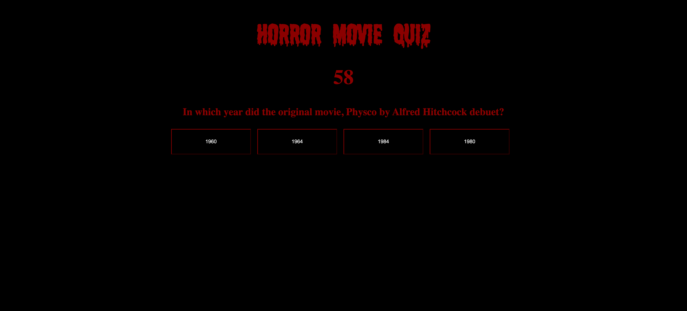
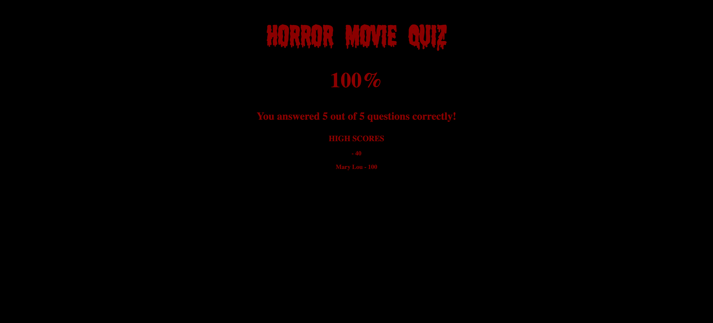

Homework 4

# Horror Movie Quiz
This timed triva quiz allows the user to answer 5 questions within 60 seconds. Let's see how much Horror you know!!

# Critera

- Once the user clicks the start button, a 60 second timer starts and the user is presented with the first question.
- When the user answers the question by clicking the box of their choosing, user is presented with another question.
- If the user answered question incorrectly, 5 seconds is removed from the clock.
- Once all questions are answered or the timer reaches 0, the game is over and the users score is displayed. 
- The user is also presented with a box to input their initial to save their scores. 

# Screenshot

 

# Deployed Website

[GitHub Pages Link](https://mlh19.github.io/HorrorQuiz/)

# Other Details
- Worked on this assigment individually.

- Recieved help from TA Megan on pseudo code, and my tutor on activating the timer.

